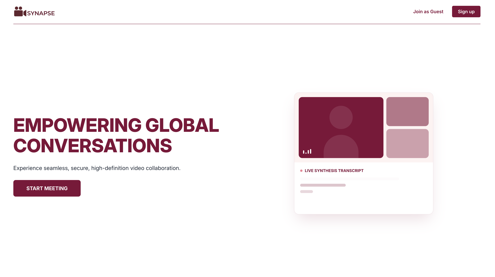
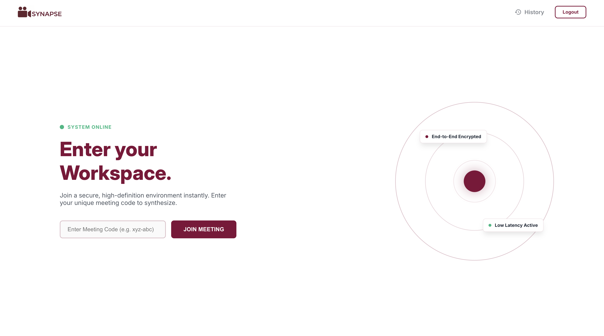
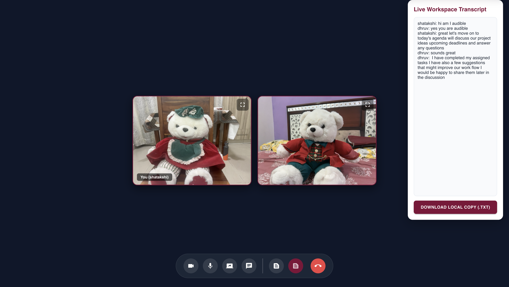
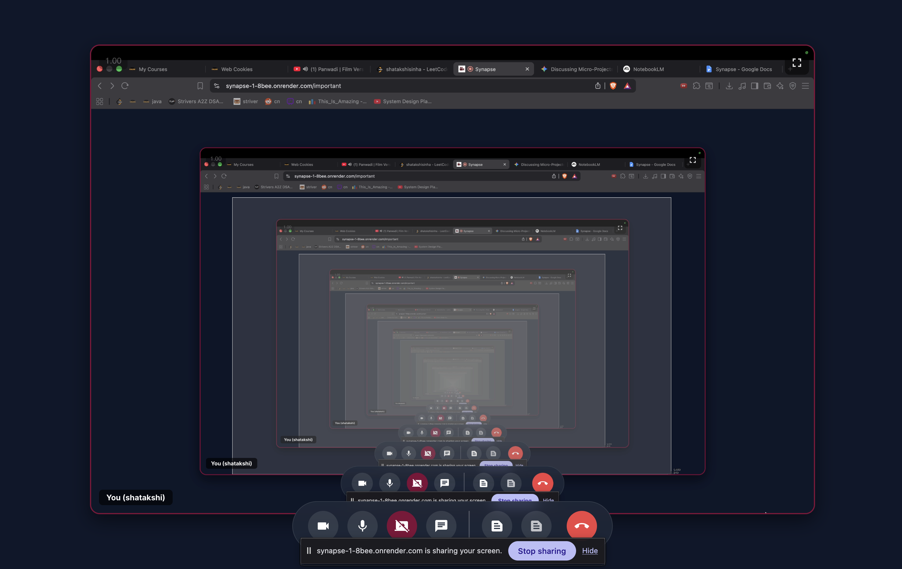
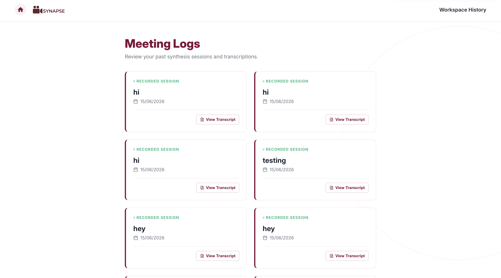
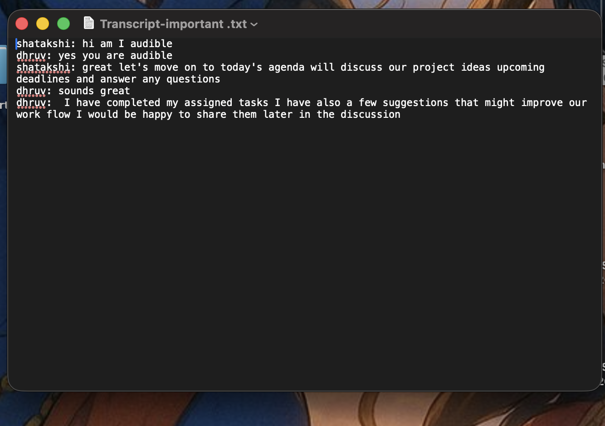

<p align="center">
  
</p>

# Synapse — Real-Time Video Conferencing & Live Transcription Platform

A scalable real-time video collaboration and live transcription ecosystem built for seamless global conversations.

[](https://synapse-1-bee.onrender.com)
[](https://webrtc.org)
[](https://socket.io)
[](https://nodejs.org)

[View Live Demo]((https://synapse-1-8bee.onrender.com/)) 

---

## Table of Contents
- [About the Project](#about-the-project)
- [Key Features](#key-features)
- [Tech Stack](#tech-stack)
- [Architecture & Signaling Flow](#architecture--signaling-flow)
- [Project Structure](#project-structure)
- [Data Models](#data-models)
- [API Routes](#api-routes)
- [Getting Started](#getting-started)
- [Environment Variables](#environment-variables)
- [Deployment](#deployment)
- [Screenshots](#screenshots)
- [License](#license)
- [Author](#author)

---

## About the Project

**Synapse** is a modern, high-definition video conferencing platform designed to solve the friction of taking manual meeting notes. By integrating native browser Web Speech API transcription directly into peer-to-peer WebRTC video streams, Synapse auto-synthesizes spoken dialogue into a live workspace transcript.

It features secure JWT-based authentication, real-time Socket.io signaling rooms, and persistent meeting logs stored via MongoDB and Mongoose.

---

## Key Features

| Feature | Description |
| :--- | :--- |
| **Real-Time P2P Streaming** | Low-latency audio/video tracks routed directly via WebRTC and `getUserMedia`. |
| **NAT Traversal Support** | Integrated STUN/TURN configurations to maintain stable connections across restrictive firewalls. |
| **Live Workspace Transcription** | Converts local speech to text via the Web Speech API and broadcasts captions in real-time. |
| **Secure Authentication** | Sign-in/sign-up flows protected with `bcrypt` hashing and HTTP-only cookie JWT storage. |
| **Room Code Orchestration** | Isolated channel grouping via `socket.join(roomCode)` for multi-peer event relaying. |
| **Meeting History Logs** | Dedicated dashboard endpoints to review, inspect, and export past session transcripts (`.txt`). |
| **Rate Limiting & Security** | Configured with `express-rate-limit`, `helmet`, and strict CORS policies. |

---

## Tech Stack

### Backend
- **Node.js & Express**: Core HTTP server routing and application logic.
- **Socket.io**: Bidirectional event communication for WebRTC signaling and live chat/captions.
- **Mongoose & MongoDB**: ODM and database layer for user records and past session persistence.
- **Bcrypt & JWT**: Secure credential hashing and token-based route authorization.
- **Helmet & Express Rate Limit**: Hardened HTTP security headers and brute-force protection.

### Frontend
- **React**: Component-driven UI framework with responsive dark-mode layouts.
- **WebRTC API**: Direct peer media stream ingestion and rendering.
- **Web Speech API**: Native browser speech recognition for closed captioning.

---

## Architecture & Signaling Flow

```text
[Client A (Browser)] <--- WebRTC Media Stream (UDP) ---> [Client B (Browser)]
        │                                                       │
        └─────── Socket.io Signaling (Offers, Answers, ICE) ────┘
                                   │
                                   ▼
                      [Node.js / Express Server]
                                   │
                                   ▼
                          [MongoDB Atlas DB]

```

---

## Project Structure

```text
synapse/
├── backend/
│   ├── src/
│   │   ├── controllers/
│   │   │   ├── socketManager.js       # Real-time WebSocket signaling & room logic
│   │   │   └── user.controller.js     # Auth & session request handlers
│   │   ├── models/
│   │   │   ├── meeting.model.js       # Room & transcript metadata schema
│   │   │   └── user.model.js          # User credentials schema
│   │   └── routes/
│   │       └── users.routes.js        # API endpoints for authentication/users
│   ├── app.js                         # Express server & middleware initialization
│   ├── package.json
│   └── package-lock.json
└── frontend/
    ├── public/
    │   ├── index.html
    │   ├── logo.png
    │   ├── together logo.png
    │   ├── writtenlogo.png
    │   ├── manifest.json
    │   └── robots.txt
    └── src/
        ├── contexts/
        │   └── AuthContext.jsx        # Global authentication state provider
        ├── pages/
        │   ├── VideoMeet.jsx          # Active video conferencing workspace
        │   ├── authentication.jsx     # Sign in & sign up views
        │   ├── history.jsx            # Meeting logs dashboard
        │   ├── home.jsx               # Post-login workspace landing
        │   └── landing.jsx            # Public marketing landing page
        ├── styles/
        │   └── videoComponent.module.css
        ├── utils/
        │   └── withAuth.jsx           # Protected route authorization wrapper
        ├── App.js                     # Root React router setup
        └── index.js

```

---

## Data Models

### User Schema (`backend/src/models/user.model.js`)

```javascript
{
  username: { type: String, required: true },
  email:    { type: String, required: true, unique: true },
  password: { type: String, required: true } // bcrypt-hashed
}

```

### Meeting / Transcript Schema (`backend/src/models/meeting.model.js`)

```javascript
{
  title:       { type: String, required: true },
  roomCode:    { type: String, required: true },
  user:        { type: mongoose.Schema.Types.ObjectId, ref: 'User' },
  transcript:  { type: String, default: '' },
  timestamp:   { type: Date, default: Date.now }
}

```

---

## API Routes

| Method | Endpoint | Description | Auth Required |
| --- | --- | --- | --- |
| `POST` | `/api/auth/signup` | Register a new user profile | No |
| `POST` | `/api/auth/login` | Authenticate and issue HTTP-only JWT cookie | No |
| `GET` | `/api/sessions/history` | Fetch all historical meeting logs for user | Yes |
| `POST` | `/api/sessions/save` | Persist accumulated room transcript to DB | Yes |

---

## Getting Started

### Prerequisites

* Node.js (v18 or higher)
* MongoDB instance or MongoDB Atlas connection string

### Installation

1. Clone the repository:
```bash
git clone [https://github.com/shatakshi1704/synapse.git](https://github.com/shatakshi1704/synapse.git)
cd synapse

```


2. Install dependencies:
```bash
npm install

```


3. Set up your `.env` file in the root directory.
4. Start the server:
```bash
npm run start

```


---

## Environment Variables

Create a `.env` file in the root directory with the following keys:

```env
PORT=5000
MONGO_URI=your_mongodb_connection_string_here
JWT_SECRET=your_jwt_super_secret_key
SALT_ROUNDS=10

```

---

## Deployment

The application is optimized for containerized cloud deployment on platforms like **Render**.

* **Build Command**: `npm install`
* **Start Command**: `node server.js`

---

## Screenshots
<p align="center">
  
  
  
  
  
  
</p>

___

## Author

**Shatakshi**

* GitHub: [@shatakshi1704](https://github.com/shatakshi1704/synapse)


